# PredictDotFun/PredictDotLoan

## Description

predict.loan is a peer to peer lending protocol for conditional tokens traded on predict.fun. Lenders and borrowers
create supply and demand by signing loan offers and borrow requests off-chain. The struct `Proposal` is used to define both loan
offers and borrow requests. Counterparties can either taker the terms defined by makers or match their terms against makers.
Once the terms have been agreed, a loan is created, collaterals are locked in the contract and interest starts accruing every second based on the interest rate.

Each loan has a minimum duration. Lenders are not allowed to call a loan before the loan's duration is over. Borrowers
are free to repay any time before the duration is over, but they must repay the entirety of their loans. After a loan is called,
the borrower can still repay the loan in order to access his collateral, as long as there isn't a bidder for the collateral's Dutch
auction. The owed amount increases every second but stops increasing once the lender calls the loan.

When an unpaid loan is called, the loan enters an 1 day Dutch auction and new lenders can take over by repaying the debt. The new loan's
interest rate starts from the lowest possible value and increases linearly until it hits the maximum allowed value (10,000%). New lenders
do not have the liberty to choose what interest rate to offer. The contract determines what it should be.

If there aren't lenders to take over the called loan. The current lender can seize the loan's collateral after the Dutch auction is over.

When borrowers see more attractive loan offers, they can use these loan offers to refinance their loans. These loan offers are used to pay off
their current loans and new loans are created on different terms. This feature is only available for uncalled loans.

While borrowers can refinance their loans one by one, predict.fun has the option to run a bot off-chain with the role `REFINANCIER_ROLE`,
which is allowed to batch submit refinancing deals on behalf of borrowers. This allows predict.fun to create an auto-refinance product,
which is lacking in other peer to peer lending protocols.

predict.loan is tightly integrated to predict.fun's prediction market protocol. The only allowed collaterals are the conditional tokens being traded on the CTF and Neg Risk CTF exchange. They must not have been resolved by UMA. Borrowers are also allowed to accept loan offers without putting any
collateral upfront, use the borrowed amount to fill a predict.fun exchange order and use the proceed as collateral.

## Getting Started

Set an dotenv file with:

```
FOUNDRY_INVARIANT_FAIL_ON_REVERT=true
```

then

```
yarn install --ignore-scripts
forge install foundry-rs/forge-std
forge install dapphub/ds-test
FOUNDRY_PROFILE=local forge test
```

## User Flows

### Accept loan offer

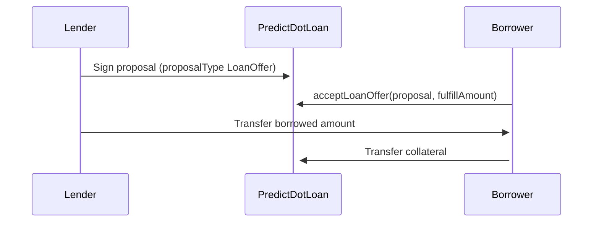

### Accept borrow request

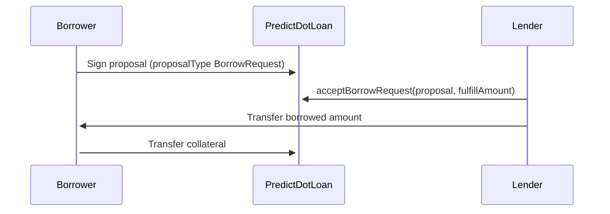

### Accept loan offer and fill order

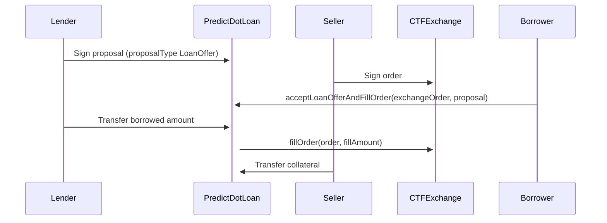

### Match a loan offer against a borrow request

In order for a loan offer to be matched with a borrow request, the following conditions must be fulfilled:

1. The borrow request's collateralization ratio must be higher than the loan offer's collateralization ratio
2. The borrow request's interest rate per second must be higher than the loan offer's interest rate per second
3. The loan offer's duration must be higher than the borrow request's duration

Unlike `acceptBorrowRequest` and `acceptLoanOffer`, `fulfillAmount` cannot be specified by the caller. The contract
calculates the available fulfill amount for both the loan offer and the borrow request and picks the lesser as the
fulfill amount.

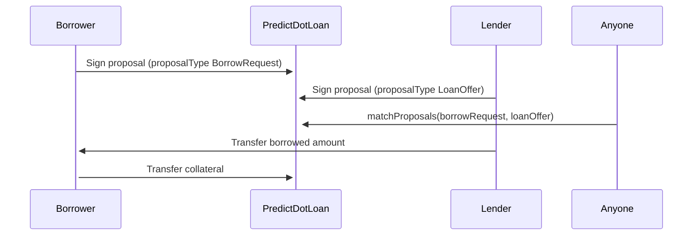

### Repay a loan

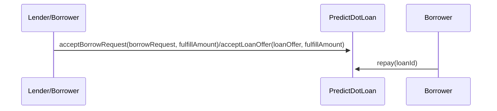

### Refinance a loan

In order for a new loan to be refinanced, the following conditions must be fulfilled:

1. The new loan offer must have an interest rate at least as good as the current loan's
2. The new loan offer's collateral amount required must not be higher than the current loan's

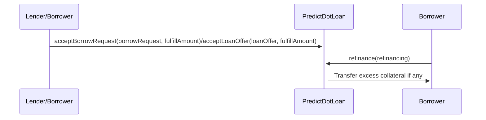

### Refinance multiple loans

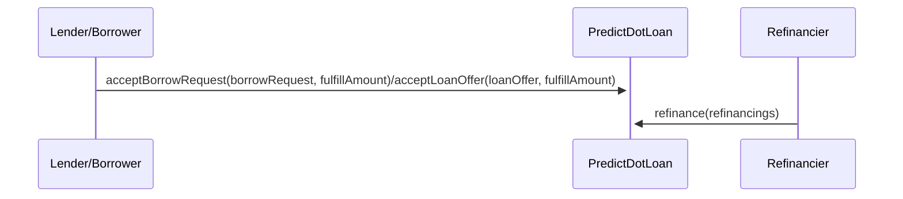

### Call a loan

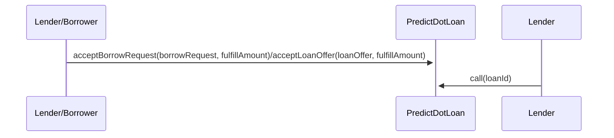

### Bid on auctioned collateral

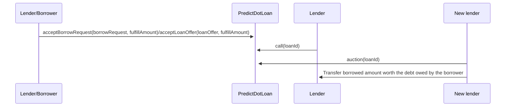

### Cancel a proposal

Each proposal has a unique salt and it can only be used by one proposal on each side.
It is ok to have a loan offer and a borrow request to share the same salt but it is not
ok to have two proposals of the same type to share the same salt.

When a user wants to cancel a proposal, he has to specify the salt and the side(s) he wants
to cancel (lending or borrowing or both).

```
struct SaltCancellationRequest {
    uint256 salt;
    bool lending;
    bool borrowing;
}
```

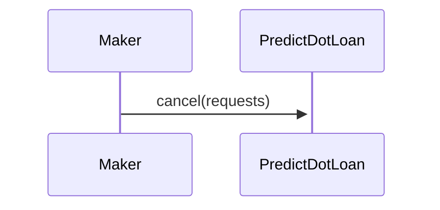

### Increment nonces

Each user has a lending nonce and a borrowing nonce. All proposals with nonce == the user's current nonce
are executable. Users can cancel all proposals in a single transaction with his current nonce by incrementing
his nonce.

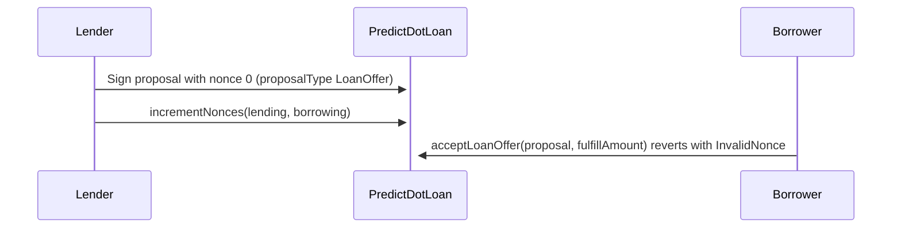

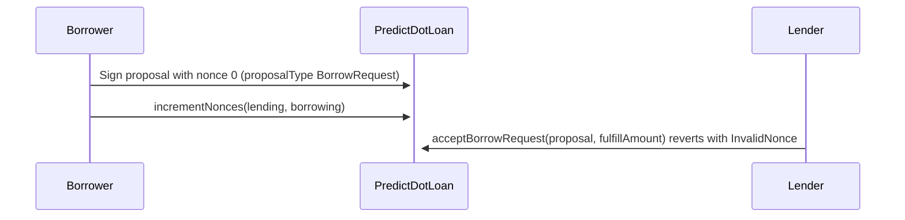
